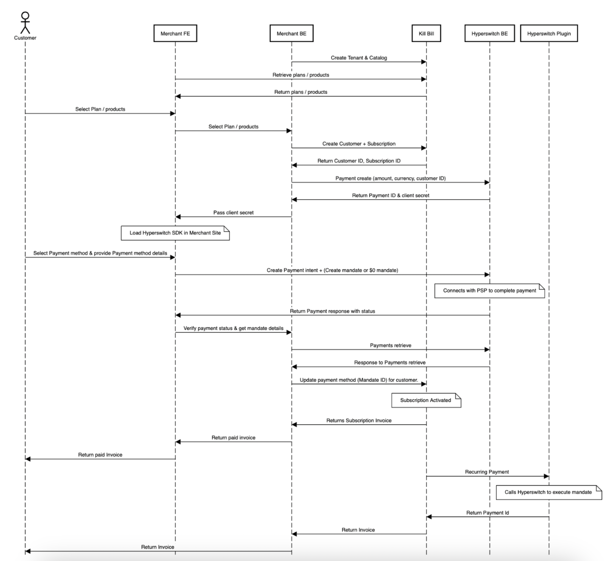
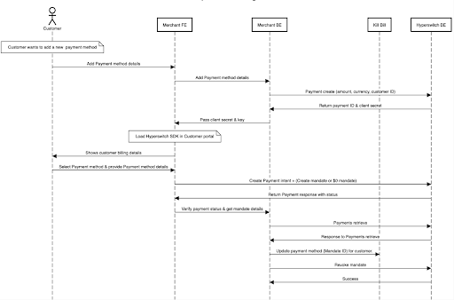
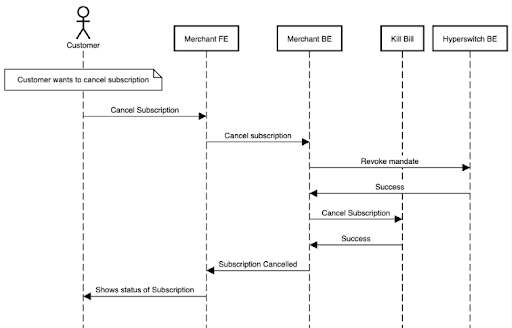

# hyperswitch-killbill-plugin

Killbill payment plugin to use [Hyperswitch](https://hyperswitch.io/) as a payment orchastrator.


## Requirements

The plugin needs a database. The latest version of the schema can be found [here](https://github.com/juspay/hyperswitch-killbill-plugin.git/blob/d07af03287fe91354278a6b2202b6e82bf08d07a/src/main/resources/ddl.sql).

A merchant can process payments with Hyperswitch while using Kill Bill as follows  
- Sign up on the Hyperswitch dashboard
- Set up your merchant account and profile 
- Set up the payment processors you’d want to process through.
We support 55+ payment processor globally and can add any new processor on request.

**Merchant** - Entity integrating with Kill Bill and Hyperswitch.

**User** - The end consumer who is making the purchase on the Merchant’s website. 

## Installation

Locally:

```
kpm install_java_plugin hyperswitch --from-source-file target/hyperswitchplugin-*-SNAPSHOT.jar --destination /var/tmp/bundles
```

## Configuration

Create an apikey from hyperswitch dashboard. To know more click [here](https://docs.hyperswitch.io/hyperswitch-open-source/account-setup/using-hyperswitch-control-center#user-content-create-an-api-key)

Then, go to the Kaui plugin configuration page (`/admin_tenants/1?active_tab=PluginConfig`), and configure the `hyperswitch` plugin with your key:

```java
org.killbill.billing.plugin.hyperswitch.hyperswitchApikey=API_KEY
org.killbill.billing.plugin.hyperswitch.environment=ENVIRONMENT
```

Alternatively, you can upload the configuration directly:

```bash
curl -v \
     -X POST \
     -u admin:password \
     -H 'X-Killbill-ApiKey: bob' \
     -H 'X-Killbill-ApiSecret: lazar' \
     -H 'X-Killbill-CreatedBy: admin' \
     -H 'Content-Type: text/plain' \
     -d 'org.killbill.billing.plugin.hyperswitch.hyperswitchApikey=API_KEY
org.killbill.billing.plugin.hyperswitch.environment=ENVIRONMENT' \
     http://127.0.0.1:8080/1.0/kb/tenants/uploadPluginConfig/hyperswitch-plugin
```
# Add mandate id to payment method

Create mandate id with killbill customer id at hyperswitch pass this mandate id to killbill. add `idDefault=true` in query parmas to make this payment method to default for killbill account.

```
curl --location --request POST 'http://127.0.0.1:8080/1.0/kb/accounts/<KB_ACCOUNT_ID>/paymentMethods?isDefault=true' \
--header 'X-Killbill-ApiKey: bob' \
--header 'X-Killbill-ApiSecret: lazar' \
--header 'Content-Type: application/json' \
--header 'Accept: application/json' \
--header 'X-Killbill-CreatedBy: demo' \
--header 'X-Killbill-Reason: demo' \
--header 'X-Killbill-Comment: demo' \
--data-raw '{
  			"pluginName": "hyperswitch-plugin",
  			"pluginInfo": {
    			"isDefaultPaymentMethod": true,
    			"properties": [
      				{
        				"key": "mandateId",
        				"value": "YOUR_MANDATE_ID",
        				"isUpdatable": false
      				}
    			]
  			}
		}'
```
Note : If your customer is not same as killbill account id pass the pass it with properties(This flow will be updated).

# Purchase payment 

Inorder to make merchant initiated transaction call payments api at killbill.

```
curl --location --request POST 'http://127.0.0.1:8080/1.0/kb/accounts/<KB_ACCOUNT_ID>/payments' \
--header 'X-Killbill-ApiKey: bob' \
--header 'X-Killbill-ApiSecret: lazar' \
--header 'X-Killbill-CreatedBy: tutorial' \
--header 'Content-Type: application/json' \\
--data-raw '{
    "transactionType": "PURCHASE",
    "amount": "60",
    "currency" : "USD"
}'
```

# Payments retrieve

By default, Hyperswitch calls payment gateway whenever you call this method for non terminal state for plugin payment status.

```
curl --location --request GET 'http://127.0.0.1:8080/1.0/kb/payments/<KB_PAYMENT_ID>?withPluginInfo=true' \
--header 'X-Killbill-ApiKey: bob' \
--header 'X-Killbill-ApiSecret: lazar' \
--header 'Accept: application/json' \
```

# User Initiated Payment 

**User flow-1** : User selects the plan first followed by adding payment method data and making payment

1. Merchant signs up on Kill Bill and creates the Tenants and Catalogs
2. User visits the Merchant app or the website and is ready to select the plan/ products
3. Merchant calls Kill Bill and retrieves the plan/ products to show the user
	a. The plan selection widget is powered by the Merchant
4. Once the User selects the plan/ products, Merchant will create a ‘Customer’ and a ‘Subscription’ with Kill Bill
5. Payment initiation 
	a. Merchant makes a ‘Payment create’ call with Hyperswitch to get the client secret and load the Hyperswitch SDK ([more on SDK integration](https://docs.hyperswitch.io/hyperswitch-cloud/integration-guide))
	b. The User selects the payment method and enters the payment method details like Card no, expiry etc.
	c. The Merchant creates a ‘Payment intent’ call with these details and creates either a regular mandate ([more details](https://docs.hyperswitch.io/features/payment-flows-and-management/mandates-and-recurring-payments)) or a $0 mandate ([more details](https://docs.hyperswitch.io/features/payment-flows-and-management/zero-amount-authorization))
		i. $0 mandate essentially is useful to delay the billing cycle in case of a trial period 
	d. The Merchant gets the successful payments response and makes a ‘Payments retrieve’ call to get the mandate ID of the transaction.
<br>

6. Once the payment is done, the Merchant updates the mandate ID in Kill Bill and marks the subscription as active
7. The recurring payments (Merchant initiated transactions) are done with direct interaction between Kill Bill and Hyperswitch via the Hyperswitch plug-in.

**User flow-2** : Collect and save user payment method followed by plan section and payment
We support user flow-2 with just a few modifications in the API flows shared as part of use flow-1.

# Subscription modification by users

**1. User updates payment method details** : The merchant will load Hyperswitch SDK to allow the user to select the payment method and add the relevant payment method details. Merchant will validate and add this payment method with Hyperswitch using the $0 mandate and create a new mandate.
The customer facing subscription management portal will have to be designed by the merchant.

<br>


**2. User cancels subscriptions** : The merchant will revoke the mandate with Hyperswitch, post which they will cancel the subscription with the subscription provider.
<br>


## Advantages of using Hyperswitch
- Support for 2 core flows of subscription creation
	- User flow 1 : User selects the plan first followed by adding payment method data and making payment
	- User flow 2 : Collect and save user payment method followed by plan section and payment
- Support for $0 mandate and card tokenization at Hyperswitch 
- Get access to advanced upcoming subscription payment features in [Q1 roadmap](https://docs.hyperswitch.io/about-hyperswitch/roadmap)
	- Support for connector agnostic subscription payments (MIT) with network_reference_id (in roadmap)  
	- Support for payment transactions using gateway token (in roadmap) 
- Flexibility to route one-time transactions to any gateway
- Centralized payment token storage 
- Unified payment analytics 
- Flexible on pricing and support (more details)

## About

Hyperswitch is a community-led, open payments switch to enable access to the best payments infrastructure for every digital business.Get updates on Hyperswitch development and chat with the community:

[Discord server](https://discord.com/invite/wJZ7DVW8mm) for questions related to contributing to hyperswitch, questions about the architecture, components, etc.
[Slack Workspace](https://hyperswitch-io.slack.com/ssb/redirect) for questions related to integrating hyperswitch, integrating a connector in hyperswitch, etc.
